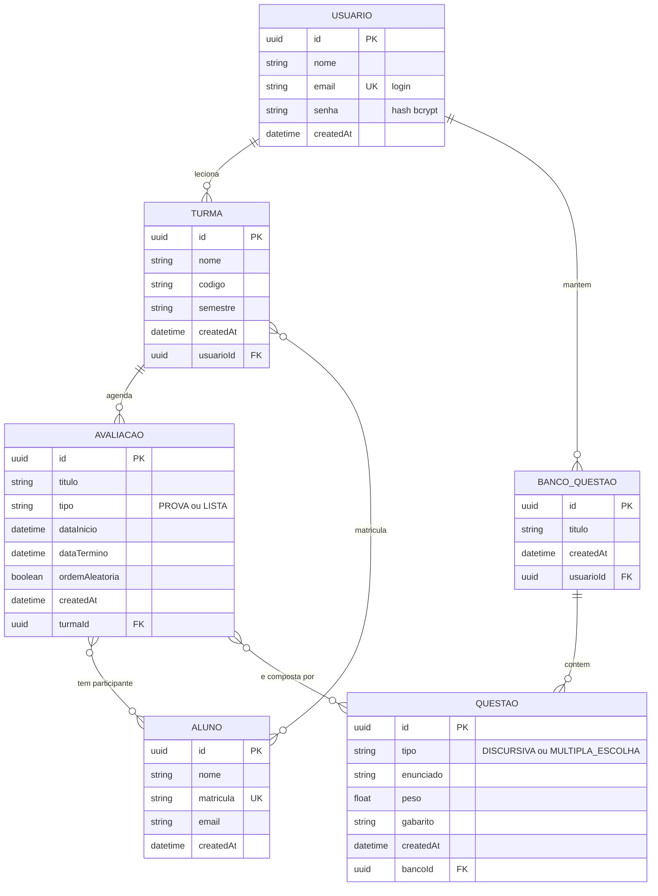
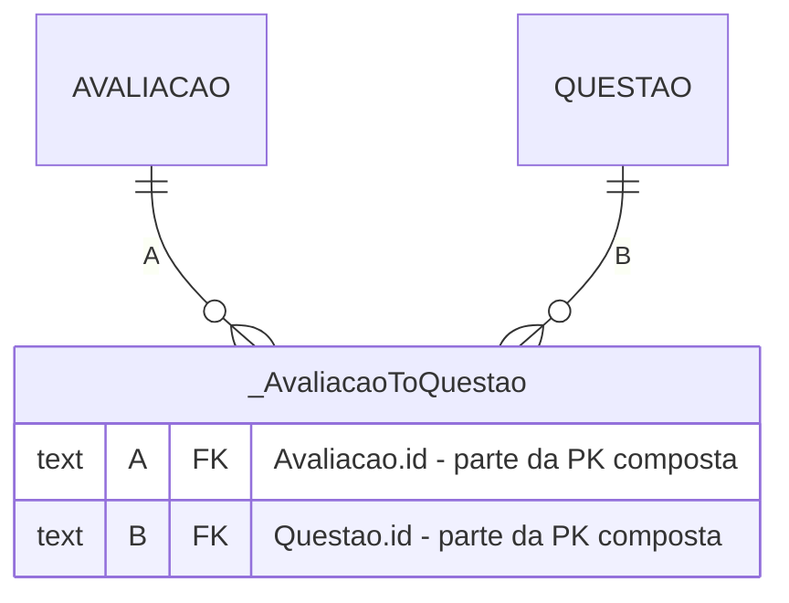

# Modelo Entidade-Relacionamento

Modelo de dados da Plataforma de Gerenciamento de Avaliações (Provius).

- **Banco:** PostgreSQL 17
- **ORM:** Prisma 7
- **Fonte da verdade:** [`prisma/schema.prisma`](../prisma/schema.prisma)
- **Migrations:** `20260730193651_init`, `20260730233205_banco_questao_por_professor`

---

## Diagrama conceitual



---

## Entidades

### `Usuario` — o professor

Quem usa a plataforma. A senha é armazenada apenas como **hash bcrypt**, nunca em
texto puro. O `email` é único e serve como identificador de login.

### `Turma` — disciplina em um semestre

Pertence a um professor. O `codigo` **não** é único: a mesma disciplina pode ser
ofertada em semestres diferentes, gerando turmas distintas com o mesmo código.

### `Aluno` — matriculado em uma ou mais turmas

A `matricula` é única no sistema inteiro. Consequência de modelagem: o mesmo aluno
presente em duas turmas é **um único registro** vinculado às duas, e não dois
registros duplicados. Isso torna a matrícula de um aluno já existente uma operação
de vínculo (`connectOrCreate`), não de criação.

### `BancoQuestao` — agrupamento temático

Existe para permitir **reaproveitamento**: as questões vivem no banco, não na
avaliação, e por isso a mesma questão pode compor várias avaliações.

Pertence a um professor. O schema original não tinha esse vínculo, o que deixava
os bancos globais — qualquer professor veria e editaria os bancos dos demais,
inconsistente com o tratamento dado às turmas. Corrigido na migration
`20260730233205_banco_questao_por_professor`.

### `Questao` — item avaliativo

Pertence a exatamente um banco. O campo `tipo` distingue questões discursivas de
múltipla escolha, e o `gabarito` guarda a resposta esperada (texto livre na
discursiva, alternativa correta na múltipla escolha).

### `Avaliacao` — prova ou lista agendada

Vinculada a uma turma, com janela de aplicação (`dataInicio`/`dataTermino`). É a
entidade central do sistema: combina **participantes** (alunos) e **conteúdo**
(questões), ambos por relacionamento N:M.

---

## Relacionamentos

### 1:N

| Relacionamento | Cardinalidade | Regra ao apagar o pai |
|---|---|---|
| `Usuario` → `Turma` | um professor leciona várias turmas | `Cascade` |
| `Usuario` → `BancoQuestao` | um professor mantém vários bancos | `Cascade` |
| `Turma` → `Avaliacao` | uma turma tem várias avaliações | `Cascade` |
| `BancoQuestao` → `Questao` | um banco contém várias questões | `Cascade` |

O `onDelete: Cascade` é necessário para integridade referencial: sem ele, apagar
uma turma que possui avaliações resultaria em erro de chave estrangeira.

### N:M

| Relacionamento | Significado |
|---|---|
| `Turma` ↔ `Aluno` | matrícula: um aluno cursa várias turmas; uma turma tem vários alunos |
| `Avaliacao` ↔ `Aluno` | participantes selecionados para aquela avaliação |
| `Avaliacao` ↔ `Questao` | montagem da prova: uma questão reaproveitada em várias avaliações |

Note que `Avaliacao ↔ Aluno` **não é redundante** com `Turma ↔ Aluno`: nem todo
aluno da turma necessariamente participa de toda avaliação (segunda chamada,
prova substitutiva, atividade para um subgrupo).

---

## Modelo físico das relações N:M

Em banco relacional, um relacionamento N:M **sempre** exige uma terceira tabela —
não há como representar "muitos para muitos" com duas tabelas apenas. No Prisma,
declarar a relação de forma **implícita** (apenas as listas nos dois lados, sem
model intermediário) faz o ORM criar e gerenciar essa tabela automaticamente.

As três tabelas geradas neste projeto:

| Tabela | Coluna `A` | Coluna `B` |
|---|---|---|
| `_AlunoToTurma` | → `Aluno.id` | → `Turma.id` |
| `_AlunoToAvaliacao` | → `Aluno.id` | → `Avaliacao.id` |
| `_AvaliacaoToQuestao` | → `Avaliacao.id` | → `Questao.id` |



Estrutura real, verificada no banco:

```sql
CREATE TABLE "_AvaliacaoToQuestao" (
    "A" TEXT NOT NULL,  -- FK -> Avaliacao(id)  ON DELETE CASCADE
    "B" TEXT NOT NULL   -- FK -> Questao(id)    ON DELETE CASCADE
);
-- PRIMARY KEY composta (A, B) + índice em (B)
```

A chave primária composta `(A, B)` impede vínculos duplicados, e o índice em `B`
otimiza a navegação no sentido inverso.

### Implicação de projeto: ordem das questões

A tabela de junção implícita contém **somente as duas chaves estrangeiras**. Não
há coluna de posição, e como a tabela é gerenciada pelo Prisma, não existe sintaxe
para acrescentar uma.

Isso define o comportamento do campo `ordemAleatoria`:

- **ordem fixa** (`false`) → as questões são devolvidas na ordem de criação;
- **ordem aleatória** (`true`) → o embaralhamento é aplicado no backend, na
  leitura da avaliação.

**Limitação assumida:** o professor não pode reordenar manualmente as questões.
Suportar isso exigiria substituir a junção implícita por um model explícito
(ex.: `AvaliacaoQuestao` com um campo `ordem`) — que continuaria sendo N:M, mas
com atributo próprio no relacionamento.

---

## Decisões de modelagem

| Decisão | Motivo |
|---|---|
| `uuid` como PK em vez de inteiro sequencial | não expõe volume de dados nem permite adivinhar IDs de outros registros |
| `createdAt` em todas as entidades | o `uuid` não é ordenável cronologicamente; sem esse campo seria impossível listar "turmas recentes" no dashboard |
| `tipo` como `String` em vez de `enum` | mantém a portabilidade do schema entre provedores e simplifica a validação na camada de controller |
| `peso` como `Float` | permite pesos fracionários (0.5, 1.5) na composição da nota |
| `matricula` única globalmente | evita duplicar o mesmo aluno presente em várias turmas |
| Junções N:M implícitas | menos código nas leituras e escritas; o custo é a impossibilidade de guardar atributos no relacionamento |
